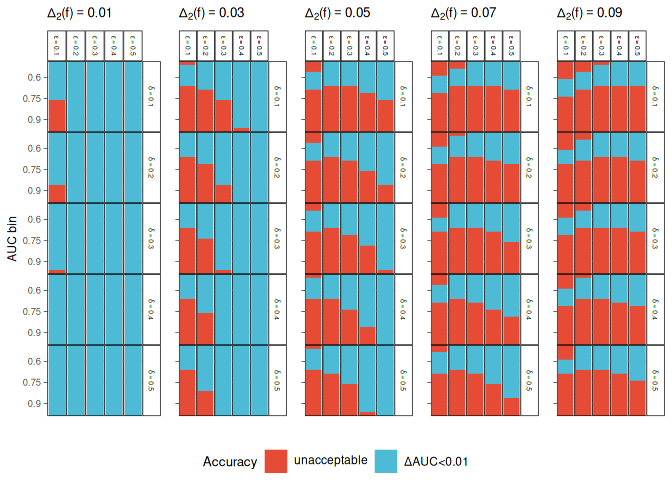
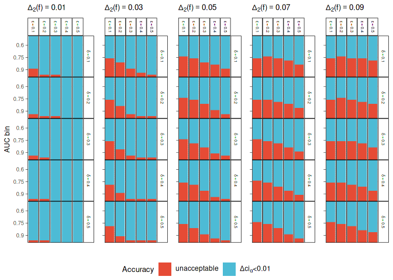

Calculation of the ROC-GLM and AUC confidence interval for distributed
non-disclosive analysis in DataSHIELD
================

<!-- README.md is generated from README.Rmd. Please edit that file -->

## About the repository

This repository contains all code that is needed to run/reproduce the
simulation study for the respective paper. It also contains the code
used to create the figures and tables.

### Structure

  - File to run the simulations: `simulation.R`
  - `R` code:
      - Helper function for calculating the Probit regression, AUC
        values, and confidence intervals: `R/helper.R`
      - Code to add the experiments using `batchtools` (called by
        `simulation.R`): `R/add-experiments.R`
      - Installation script to get all required package with the version
        used for the benchmark: `R/install-pkgs-versions.R`
      - Setup variables like repetitions or the grid of values for the
        simulation for the benchmark: `R/setup.R`
  - Batchtools registry and results: `batchtools` (see
    [below](#simulation-results) how to load the results)
  - Folder for the paper figues `*.pdf` and README figures `*.png`:
    `figures`
  - Folder containing `*.tex` files of tables: `tables`

## Reproduce the results from the paper

To fully reproduce the results run the `simulation.R` script. To
reproduce the figures of the paper, render the README with
`rmarkdown::render("README.Rmd")`. When rendering the README, all
figures are created and stored in `figures` while the table is stored in
`tables`.

## Analyse results

The following code was used to load and analyse the results. It can be
used to fully reproduce the figures and tables of the paper.

### Setup

``` r
# source(here::here("R/install-pkgs-versions.R"))

library(dplyr)
library(tidyr)
library(ggplot2)
library(gridExtra)
library(ggsci)
library(ggridges)
library(knitr)
library(batchtools)


### Theme setup:
## ==================================================================

# Set font (if available):
font = "Tinos"
sysfonts::font_add_google(font, font)
extrafont::loadfonts()
ft = extrafont::fonttable()

if (all(! grepl(font, x = ft$FamilyName))) {
  my_theme = theme_minimal()
} else {
  my_theme = theme_minimal(base_family = font)
}

theme_set(
  my_theme +
  theme(
    plot.title = element_text(size = 10),
    plot.subtitle = element_text(size = 9),
    strip.background = element_rect(fill = "white", color = "black"),
    strip.text = element_text(color = "black", face = "bold", size = 7),
    axis.text = element_text(size = 7),
    axis.title = element_text(size = 9),
    legend.title = element_text(size = 10),
    legend.text = element_text(size = 9),

    panel.border = element_rect(colour = "black", fill = NA, size = 0.5)
  )
)

# to determine width, use the latex package `layouts` and put
# `\printinunitsof{mm}\prntlen{\textwidth}` into the tex file.
textwidth = 148.92

## Helper functions:
## =====================================================================

source(here::here("R/helper.R"))

#' Open pdf files using evince on linux machines
#' @param file to the pdf
evince = function(file) system(paste0("evince ", file, " &"))
```

### Simulation Results

``` r
## Load data
loadRegistry(here::here("batchtools/"))
#> Experiment Registry
#>   Backend   : Interactive
#>   File dir  : /home/daniel/repos/simulations-distr-auc/batchtools
#>   Work dir  : /home/daniel/repos/simulations-distr-auc
#>   Jobs      : 76
#>   Problems  : 1
#>   Algorithms: 1
#>   Seed      : 31415
#>   Writeable : FALSE

### Load ROC-GLM approximation::
results = reduceResultsList()

# Split results:
# - 1. element of list contains the ordinary ROC-GLM.
# - All other elements contain the distributed ROC-GLM with differential privacy.
aucs_emp = do.call(rbind, lapply(results[[1]], function(ll) ll$aucs))
aucs_dp  = do.call(rbind, lapply(results[-1], function(ll) {
  do.call(rbind, lapply(ll, function(l) l$aucs))
}))

### Distributed ROC-GLM approximations:
app_acc = rbind(
  data.frame(lower = 0, upper = (0.8 - 0.6) * 1 / 100, qual = "$\\Delta AUC < 0.002$"),
  data.frame(lower = (0.8 - 0.6) * 1 / 100, upper = (1 - 0.5) * 1 / 100, qual = "$\\Delta AUC < 0.005$"),
  data.frame(lower = (1 - 0.5) * 1 / 100, upper = Inf, qual = "unacceptable")
)
aucs_dp = aucs_dp %>%
  mutate(
    auc_diff = abs(auc_emp - auc_roc),
    qual = cut(auc_diff, breaks = c(app_acc$lower, Inf), labels = app_acc$qual))
```

### Figures

#### AUC densities

``` r
## Comparison for different n intervals:
#nb      = c(100, 200, 400, 800, 1600, 2500)
nb      = seq(100, 2500, length.out = 7)
clabels = paste0("n in (", nb[-length(nb)], ", ", nb[-1], "]")
ncut    = cut(aucs_emp$n, breaks = nb, labels = clabels)
clabels = paste0(clabels, " (Count: ", table(ncut), ")")
ncut    = cut(aucs_emp$n, breaks = nb, labels = clabels)

aucs_emp_plt = aucs_emp %>%
  mutate(n_cat = ncut) %>%
  select(auc_emp, auc_roc, n_cat) %>%
  na.omit()

gg_den_both_facet = ggplot(data = aucs_emp_plt) +
  geom_histogram(aes(x = auc_emp, color = "Empirical AUC", fill = "Empirical AUC", y = ..density..),
     color = "white", size = 0.2, alpha = 0.4) +
  geom_histogram(aes(x = auc_roc, color = "AUC (ROC-GLM)", fill = "AUC (ROC-GLM)", y = ..density..),
     color = "white", size = 0.2, alpha = 0.2) +
  geom_histogram(aes(x = auc_emp, color = "Empirical AUC", fill = "Empirical AUC", y = ..density..),
     color = "white", size = 0.2, alpha = 0) +
  geom_density(aes(x = auc_emp, color = "Empirical AUC", fill = "Empirical AUC"),
     fill = "transparent", size = 0.6, alpha = 0.4) +
  geom_density(aes(x = auc_roc, color = "AUC (ROC-GLM)", fill = "AUC (ROC-GLM)"),
     fill = "transparent", size = 0.6, alpha = 0.2) +
  theme(legend.position = "bottom", legend.key.size = unit(0.2, "cm")) +
  xlab("AUC") +
  ylab("Density") +
  labs(fill = "", color = "") +
  scale_color_uchicago() +
  scale_fill_uchicago() +
  facet_wrap(~ n_cat)

gg_den_both_facet
```

<!-- -->

``` r

ggsave(plot = gg_den_both_facet,
  filename = here::here("figures/auc-emp-density-facets.pdf"),
  width = textwidth,
  height = textwidth * 0.5,
  units = "mm")

#evince(here::here("figures/auc-emp-density-facets.pdf"))
```

### Approximation errors

``` r
## AUC VALUES
## =======================================================

l2senss  = sort(unique(aucs_dp$l2sens))
auc_cuts = seq(0.5, 1, length.out = 21L)
ggs_auc  = list()
for (i in seq_along(l2senss)) {
  df_dp = aucs_dp %>% filter(l2sens == l2senss[i])

  tab = df_dp %>%
    mutate(
      auc_app_cut = cut(x = auc_roc, breaks = auc_cuts),
      auc_emp_cut = cut(x = auc_emp, breaks = auc_cuts)
    ) %>%
    group_by(auc_emp_cut, epsilon, delta) %>%
    summarize(
      Min.      = min(auc_diff, na.rm = TRUE),
      "1st Qu." = quantile(auc_diff, 0.25, na.rm = TRUE),
      Median    = median(auc_diff, na.rm = TRUE),
      Mean      = mean(auc_diff, na.rm = TRUE),
      "3rd Qu." = quantile(auc_diff, 0.75, na.rm = TRUE),
      Max.      = max(auc_diff, na.rm = TRUE),
      Sd.       = sd(auc_diff, na.rm = TRUE),
      Count     = n()) %>%
    mutate(qual = cut(abs(Mean), breaks = c(app_acc$lower, Inf), labels = app_acc$qual))

  tab$qual = factor(tab$qual, levels = rev(app_acc$qual))

  ggs_auc[[i]] = ggplot(na.omit(tab), aes(x = "1", y = auc_emp_cut, color = qual, fill = qual)) +
    geom_tile() +
    scale_y_discrete(limits = rev, breaks = levels(tab$auc_emp_cut)[c(5, 11, 17)],
      labels = auc_cuts[c(5, 11, 17)]) +
    xlab("") +
    theme(axis.text.x = element_blank()) +
    ylab("") +
    ylab("AUC bin") +
    scale_color_npg(labels = unname(latex2exp::TeX(rev(app_acc$qual)))) +
    scale_fill_npg(labels = unname(latex2exp::TeX(rev(app_acc$qual)))) +
    labs(color = "Accuracy", fill = "Accuracy") +
    facet_grid(delta ~ epsilon, labeller = label_bquote(delta == .(delta), epsilon == .(epsilon))) +
    theme(
      axis.ticks.y = element_line(colour = "black", size = 0.2),
      strip.text = element_text(color = "black", face = "bold", size = 5),
      panel.border = element_rect(colour = "black", fill = NA, size = 0.5),
      legend.position = "bottom",
      panel.spacing = unit(0, "lines")
    ) +
    ggtitle(latex2exp::TeX(paste0("$\\Delta_2(f) = ", l2senss[i], "$")))
}

gg_auc_dp = ggpubr::ggarrange(ggs_auc[[1]], ggs_auc[[2]], ggs_auc[[3]], ncol = 3, nrow = 1,
  common.legend = TRUE, legend = "bottom")

gg_auc_dp
```

<!-- -->

``` r

ggsave(plot = gg_auc_dp,
  filename = here::here("figures/auc-diff-priv.pdf"),
  width = textwidth * 1,
  height = textwidth * 0.5,
  units = "mm")

#evince(here::here("figures/auc-diff-priv.pdf"))
```

``` r
## CI BOUNDARIES
## =======================================================

ggs_ci = list()
for (i in seq_along(l2senss)) {

  df_dp = aucs_dp %>%
    filter(l2sens == l2senss[i])

  tab = df_dp %>%
    mutate(
      auc_app_cut = cut(x = auc_roc, breaks = auc_cuts),
      auc_emp_cut = cut(x = auc_emp, breaks = auc_cuts)
    ) %>%
    group_by(auc_emp_cut, epsilon, delta) %>%
    summarize(
      Min.      = min(delta_ci, na.rm = TRUE),
      "1st Qu." = quantile(delta_ci, 0.25, na.rm = TRUE),
      Median    = median(delta_ci, na.rm = TRUE),
      Mean      = mean(delta_ci, na.rm = TRUE),
      "3rd Qu." = quantile(delta_ci, 0.75, na.rm = TRUE),
      Max.      = max(delta_ci, na.rm = TRUE),
      Sd.       = sd(delta_ci, na.rm = TRUE),
      Count     = n()) %>%
    mutate(qual_ci = cut(Mean, breaks = c(-Inf, 0.01, Inf),
      labels = c("$\\Delta ci_{\\alpha} < 0.01", "unacceptable")))

  tab$qual_ci = factor(tab$qual_ci, levels = rev(levels(tab$qual_ci)))

  ggs_ci[[i]] = ggplot(na.omit(tab), aes(x = "1", y = auc_emp_cut, color = qual_ci, fill = qual_ci)) +
    geom_tile() +
    scale_y_discrete(limits = rev, breaks = levels(tab$auc_emp_cut)[c(5, 11, 17)],
      labels = auc_cuts[c(5, 11, 17)]) +
    xlab("") +
    theme(axis.text.x = element_blank()) +
    ylab("AUC bin") +
    scale_color_npg(labels = unname(latex2exp::TeX(levels(tab$qual_ci)))) +
    scale_fill_npg(labels = unname(latex2exp::TeX(levels(tab$qual_ci)))) +
    labs(fill = "Accuracy") +
    guides(color = "none") +
    facet_grid(delta ~ epsilon, labeller = label_bquote(delta == .(delta), epsilon == .(epsilon))) +
    theme(
      axis.ticks.y = element_line(colour = "black", size = 0.2),
      strip.text = element_text(color = "black", face = "bold", size = 5),
      panel.border = element_rect(colour = "black", fill = NA, size = 0.5),
      legend.position = "bottom",
      panel.spacing = unit(0, "lines")
    ) +
    ggtitle(latex2exp::TeX(paste0("$\\Delta_2(f) = ", l2senss[i], "$")))
}

gg_ci_dp = ggpubr::ggarrange(ggs_ci[[1]], ggs_ci[[2]], ggs_ci[[3]], ncol = 3, nrow = 1,
  common.legend = TRUE, legend = "bottom")

gg_ci
```

<!-- -->

``` r

ggsave(plot = gg_ci_dp,
  filename = here::here("figures/cis-diff-priv.pdf"),
  width = textwidth,
  height = textwidth * 0.5,
  units = "mm")

#evince(here::here("figures/cis-diff-priv.pdf"))
```

### Table of AUC values

``` r
# Discretize empirical AUC values into 20 bins between 0.5 and 1.
tab = aucs_emp %>% mutate(
    auc_diff = auc_emp - auc_roc,
    auc_app_cut = cut(x = auc_roc, breaks = seq(0.5, 1, length.out = 21L)),
    auc_emp_cut = cut(x = auc_emp, breaks = seq(0.5, 1, length.out = 21L))
  ) %>%
  group_by(auc_emp_cut) %>%
  # Calculate summary statistics per bin:
  summarize(
    "Min."    = min(auc_diff, na.rm = TRUE),
    "1st Qu." = quantile(auc_diff, 0.25, na.rm = TRUE),
    "Median"  = median(auc_diff, na.rm = TRUE),
    "Mean"    = mean(auc_diff, na.rm = TRUE),
    "3rd Qu." = quantile(auc_diff, 0.75, na.rm = TRUE),
    "Max."    = max(auc_diff, na.rm = TRUE), Sd. = sd(auc_diff, na.rm = TRUE), Count = n()) %>%
  na.omit()

tab_latex = tab %>% kable(format = "latex")
writeLines(tab_latex, here::here("tables/auc-approximations.tex"))

tab %>% kable()
```

| auc\_emp\_cut |     Min. |  1st Qu. |   Median |     Mean |  3rd Qu. |   Max. |    Sd. | Count |
| :------------ | -------: | -------: | -------: | -------: | -------: | -----: | -----: | ----: |
| (0.5,0.525\]  | \-0.0044 | \-0.0002 |   0.0002 |   0.0003 |   0.0008 | 0.0053 | 0.0009 |   384 |
| (0.525,0.55\] | \-0.0052 |   0.0000 |   0.0006 |   0.0006 |   0.0011 | 0.0042 | 0.0010 |   490 |
| (0.55,0.575\] | \-0.0031 |   0.0003 |   0.0009 |   0.0009 |   0.0015 | 0.0052 | 0.0010 |   463 |
| (0.575,0.6\]  | \-0.0018 |   0.0006 |   0.0012 |   0.0012 |   0.0017 | 0.0052 | 0.0010 |   481 |
| (0.6,0.625\]  | \-0.0044 |   0.0009 |   0.0015 |   0.0014 |   0.0020 | 0.0064 | 0.0010 |   485 |
| (0.625,0.65\] | \-0.0039 |   0.0012 |   0.0017 |   0.0017 |   0.0022 | 0.0069 | 0.0010 |   501 |
| (0.65,0.675\] | \-0.0031 |   0.0013 |   0.0018 |   0.0018 |   0.0023 | 0.0068 | 0.0011 |   503 |
| (0.675,0.7\]  | \-0.0022 |   0.0012 |   0.0018 |   0.0018 |   0.0023 | 0.0064 | 0.0010 |   465 |
| (0.7,0.725\]  | \-0.0082 |   0.0010 |   0.0016 |   0.0016 |   0.0023 | 0.0070 | 0.0012 |   523 |
| (0.725,0.75\] | \-0.0031 |   0.0008 |   0.0015 |   0.0014 |   0.0021 | 0.0087 | 0.0012 |   485 |
| (0.75,0.775\] | \-0.0058 |   0.0004 |   0.0011 |   0.0010 |   0.0018 | 0.0053 | 0.0013 |   501 |
| (0.775,0.8\]  | \-0.0053 | \-0.0003 |   0.0004 |   0.0005 |   0.0012 | 0.0088 | 0.0015 |   523 |
| (0.8,0.825\]  | \-0.0061 | \-0.0013 | \-0.0002 | \-0.0004 |   0.0005 | 0.0045 | 0.0016 |   476 |
| (0.825,0.85\] | \-0.0125 | \-0.0023 | \-0.0013 | \-0.0014 | \-0.0003 | 0.0059 | 0.0019 |   484 |
| (0.85,0.875\] | \-0.0111 | \-0.0037 | \-0.0026 | \-0.0025 | \-0.0014 | 0.0074 | 0.0020 |   520 |
| (0.875,0.9\]  | \-0.0136 | \-0.0056 | \-0.0044 | \-0.0043 | \-0.0030 | 0.0076 | 0.0023 |   534 |
| (0.9,0.925\]  | \-0.0195 | \-0.0080 | \-0.0065 | \-0.0065 | \-0.0052 | 0.0066 | 0.0026 |   515 |
| (0.925,0.95\] | \-0.0193 | \-0.0105 | \-0.0091 | \-0.0089 | \-0.0076 | 0.0056 | 0.0030 |   481 |
| (0.95,0.975\] | \-0.0227 | \-0.0138 | \-0.0113 | \-0.0113 | \-0.0093 | 0.0067 | 0.0037 |   503 |
| (0.975,1\]    | \-0.0180 | \-0.0093 | \-0.0062 | \-0.0064 | \-0.0034 | 0.0013 | 0.0039 |   529 |
