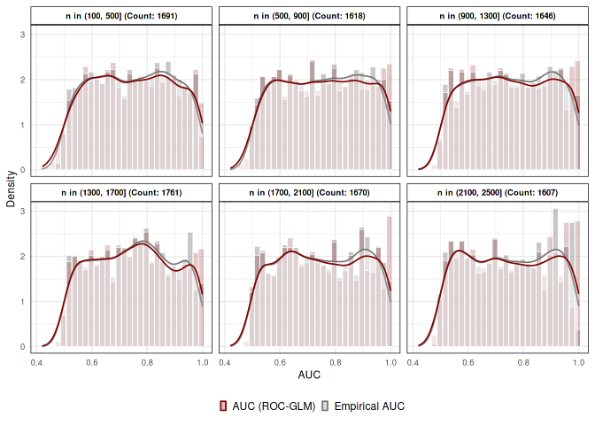

<!-- README.md is generated from README.Rmd. Please edit that file -->

## Simulation Results

``` r
## Load data

### Load ROC-GLM approximation::
load(here::here("data/ll_aucs_range.Rda"))
aucs_emp = do.call(rbind, lapply(ll_aucs, function(ll) ll$aucs))


### Load Distributed ROC-GLM approximations:
app_acc = rbind(
  data.frame(lower = 0, upper = (0.8 - 0.6) * 1 / 100, qual = "use-case"),
  data.frame(lower = (0.8 - 0.6) * 1 / 100, upper = (1 - 0.5) * 1 / 100, qual = "general"),
  data.frame(lower = (1 - 0.5) * 1 / 100, upper = Inf, qual = "unacceptable")
)

#load(here::here("data/ll_aucs_nfacs.Rda"))
#aucs_distr = do.call(rbind, lapply(ll_aucs_nfacs, function(lla) {
#  do.call(rbind, apply(lla, 1, function(ll) {
#    cbind(ll[[1]]$aucs, noisef = ll$nfac, margin = ll$margin)
#  }))
#}))
#aucs_distr = aucs_distr %>%
#  mutate(
#    auc_diff = abs(auc_emp - auc_roc),
#    qual = cut(auc_diff, breaks = c(app_acc$lower, Inf), labels = app_acc$qual),
#    margin_rel = margin / n)
#
#save(aucs_distr, file = here::here("data/aucs-distr-noise.Rda"))

load(here::here("data/aucs-distr-noise.Rda"))


### Load confidence Intervals (CIs):
cis = do.call(rbind, lapply(ll_aucs, function(ll) {
  cbind(ll$cis, ll$aucs[rep(1, 4), ])
}))

cis = cis %>%
  group_by(n, npos, threshold) %>%
  mutate(
    auc_lower_diff = logitToAUC(lower) - logitToAUC(lower[method == "DeLong Empirical"]),
    auc_upper_diff = logitToAUC(upper) - logitToAUC(upper[method == "DeLong Empirical"])
  )
```

## Figures

### AUC density

``` r
gg_den_both = ggplot(data = aucs_emp) +
  geom_histogram(aes(x = auc_emp, color = "Empirical AUC", fill = "Empirical AUC", y = ..density..),
     color = "white", size = 0.2, alpha = 0.4) +
  geom_histogram(aes(x = auc_roc, color = "AUC (ROC-GLM)", fill = "AUC (ROC-GLM)", y = ..density..),
     color = "white", size = 0.2, alpha = 0.2) +
  geom_histogram(aes(x = auc_emp, color = "Empirical AUC", fill = "Empirical AUC", y = ..density..),
     color = "white", size = 0.2, alpha = 0) +
  geom_density(aes(x = auc_emp, color = "Empirical AUC", fill = "Empirical AUC"),
     fill = "transparent", size = 0.6, alpha = 0.4) +
  geom_density(aes(x = auc_roc, color = "AUC (ROC-GLM)", fill = "AUC (ROC-GLM)"),
     fill = "transparent", size = 0.6, alpha = 0.2) +
  theme(legend.position = "bottom", legend.key.size = unit(0.2, 'cm')) +
  xlab("AUC") +
  ylab("Density") +
  labs(fill = "", color = "") +
  my_fill + my_color

gg_den_both
```

<!-- -->

``` r

ggsave(plot = gg_den_both,
  filename = here::here("figures/auc-emp-density.pdf"),
  width = textwidth * 0.4,
  height = textwidth * 1/4,
  units = "mm")
```

### Compare CIs

``` r
cis$ci_range = cis$upper - cis$lower
nb = c(0, 200, 400, 800, 1600, 3200)

cis_plt = cis %>%
  pivot_longer(cols = c("lower", "upper"), names_to = "ci") %>%
  mutate(
    auc_cat = cut(auc_emp, breaks = seq(0.5, 1, length.out = 11L)),
    n_cat = cut(n, breaks = nb, labels = paste0("n in (", nb[-length(nb)], ", ", nb[-1], "]")),
    value = logitToAUC(value)) %>%
  select(-noise) %>%
  na.omit()

#gg_short = cis_plt %>% filter(((n > 200) & (n < 400)) | ((n > 1600 & n < 3200))) %>% filter(auc_cat %in% c("(0.5,0.55]", "(0.7,0.75]")) %>%
gg_cis = cis_plt %>%
  ggplot(aes(x = value, fill = ci, y = method, color = ci)) +
  geom_density_ridges(alpha = 0.5, rel_min_height = 0.01, show.legend = FALSE) + #, color = "transparent") +
  #theme_ridges(grid = TRUE, center_axis_labels = TRUE) +
  scale_x_continuous(breaks = seq(0.5, 1, 0.1)) +
  xlab("AUC") +
  ylab("") +
  labs(fill = "CI Boundary") +
  facet_grid(paste0("AUC in\n", auc_cat) ~ n_cat) +
  ggtitle("Comparison of 95 % AUC CIs", subtitle = paste0("Lower CI (red) and upper CI (gray) of ", nrow(aucs_emp), " repetitions")) +
  theme(axis.text.x = element_text(angle = 45, hjust = 1)) +
  my_color + my_fill

gg_cis
```

<!-- -->

``` r

ggsave(plot = gg_cis,
  filename = here::here("figures/auc-cis.pdf"),
  width    = textwidth * 1.2,
  height   = textwidth * 1.3,
  units    = "mm")
```

### Approximation errors

``` r
tab = aucs_distr %>% mutate(
    auc_diff    = auc_emp - auc_roc,
    auc_app_cut = cut(x = auc_roc, breaks = seq(0.5, 1, length.out = 21L)),
    auc_emp_cut = cut(x = auc_emp, breaks = seq(0.5, 1, length.out = 21L))
  ) %>%
  group_by(auc_emp_cut, noisef, margin) %>%
  summarize(
    Min.      = min(auc_diff, na.rm = TRUE),
    "1st Qu." = quantile(auc_diff, 0.25, na.rm = TRUE),
    Median    = median(auc_diff, na.rm = TRUE),
    Mean      = mean(auc_diff, na.rm = TRUE),
    "3rd Qu." = quantile(auc_diff, 0.75, na.rm = TRUE),
    Max.      = max(auc_diff, na.rm = TRUE),
    Sd.       = sd(auc_diff, na.rm = TRUE),
    Count     = n()) %>%
  mutate(qual = cut(abs(Mean), breaks = c(app_acc$lower, Inf), labels = app_acc$qual))

tab$qual = factor(tab$qual, levels = c("unacceptable", "general", "use-case"))

gg_dist = ggplot(na.omit(tab), aes(x = "1", y = auc_emp_cut, color = qual, fill = qual)) +
  geom_tile() +
  scale_y_discrete(limits = rev, breaks = levels(tab$auc_emp_cut)[c(5, 16)]) +
  xlab("") +
  theme(axis.text.x = element_blank()) +
  ylab("AUC bin") +
  scale_color_npg() + scale_fill_npg() + # Looks nicer than uchicago
  #my_color + my_fill +
  labs(color = "Accuracy", fill = "Accuracy") +
  facet_grid(noisef ~ margin)

gg_dist
```

<!-- -->

``` r

ggsave(plot = gg_dist,
  filename = here::here("figures/auc-distr.pdf"),
  width = textwidth * 0.8,
  height = textwidth * 0.8,
  units = "mm")
```

## Tables

``` r
tab = aucs_emp %>% mutate(
    auc_diff = auc_emp - auc_roc,
    auc_app_cut = cut(x = auc_roc, breaks = seq(0.5, 1, length.out = 21L)),
    auc_emp_cut = cut(x = auc_emp, breaks = seq(0.5, 1, length.out = 21L))
  ) %>%
  group_by(auc_emp_cut) %>%
  summarize(Min. = min(auc_diff, na.rm = TRUE), "1st Qu." = quantile(auc_diff, 0.25, na.rm = TRUE),
    Median = median(auc_diff, na.rm = TRUE), Mean = mean(auc_diff, na.rm = TRUE), "3rd Qu." = quantile(auc_diff, 0.75, na.rm = TRUE),
    Max. = max(auc_diff, na.rm = TRUE), Sd. = sd(auc_diff, na.rm = TRUE), Count = n())

tab_latex = tab %>% kable(format = "latex")
writeLines(tab_latex, here::here("tables/auc-approximations.tex"))

tab %>% kable()
```

| auc\_emp\_cut |     Min. |  1st Qu. |   Median |     Mean |  3rd Qu. |     Max. |    Sd. | Count |
| :------------ | -------: | -------: | -------: | -------: | -------: | -------: | -----: | ----: |
| (0.5,0.525\]  | \-0.0045 | \-0.0002 |   0.0003 |   0.0003 |   0.0008 |   0.0041 | 0.0010 |   366 |
| (0.525,0.55\] | \-0.0060 |   0.0000 |   0.0006 |   0.0005 |   0.0011 |   0.0034 | 0.0010 |   510 |
| (0.55,0.575\] | \-0.0030 |   0.0004 |   0.0009 |   0.0009 |   0.0014 |   0.0052 | 0.0010 |   465 |
| (0.575,0.6\]  | \-0.0025 |   0.0008 |   0.0013 |   0.0013 |   0.0018 |   0.0044 | 0.0009 |   492 |
| (0.6,0.625\]  | \-0.0029 |   0.0009 |   0.0015 |   0.0015 |   0.0021 |   0.0063 | 0.0010 |   491 |
| (0.625,0.65\] | \-0.0029 |   0.0012 |   0.0017 |   0.0017 |   0.0022 |   0.0063 | 0.0010 |   512 |
| (0.65,0.675\] | \-0.0039 |   0.0012 |   0.0018 |   0.0018 |   0.0024 |   0.0058 | 0.0011 |   484 |
| (0.675,0.7\]  | \-0.0029 |   0.0013 |   0.0018 |   0.0018 |   0.0024 |   0.0050 | 0.0011 |   504 |
| (0.7,0.725\]  | \-0.0042 |   0.0011 |   0.0018 |   0.0017 |   0.0023 |   0.0067 | 0.0011 |   486 |
| (0.725,0.75\] | \-0.0045 |   0.0008 |   0.0015 |   0.0014 |   0.0022 |   0.0054 | 0.0012 |   494 |
| (0.75,0.775\] | \-0.0033 |   0.0005 |   0.0011 |   0.0012 |   0.0018 |   0.0064 | 0.0012 |   528 |
| (0.775,0.8\]  | \-0.0061 | \-0.0002 |   0.0006 |   0.0005 |   0.0013 |   0.0065 | 0.0014 |   544 |
| (0.8,0.825\]  | \-0.0066 | \-0.0011 | \-0.0002 | \-0.0002 |   0.0007 |   0.0071 | 0.0015 |   482 |
| (0.825,0.85\] | \-0.0096 | \-0.0023 | \-0.0013 | \-0.0014 | \-0.0004 |   0.0047 | 0.0017 |   494 |
| (0.85,0.875\] | \-0.0126 | \-0.0039 | \-0.0027 | \-0.0028 | \-0.0016 |   0.0062 | 0.0021 |   493 |
| (0.875,0.9\]  | \-0.0122 | \-0.0057 | \-0.0045 | \-0.0044 | \-0.0031 |   0.0019 | 0.0021 |   523 |
| (0.9,0.925\]  | \-0.0153 | \-0.0083 | \-0.0066 | \-0.0066 | \-0.0051 |   0.0019 | 0.0023 |   482 |
| (0.925,0.95\] | \-0.0247 | \-0.0105 | \-0.0092 | \-0.0091 | \-0.0076 |   0.0024 | 0.0025 |   446 |
| (0.95,0.975\] | \-0.0207 | \-0.0135 | \-0.0115 | \-0.0115 | \-0.0094 | \-0.0029 | 0.0030 |   519 |
| (0.975,1\]    | \-0.0145 | \-0.0093 | \-0.0075 | \-0.0076 | \-0.0057 |   0.0004 | 0.0027 |   544 |
| NA            | \-0.0034 | \-0.0006 |   0.0000 |   0.0000 |   0.0005 |   0.0046 | 0.0012 |   141 |
